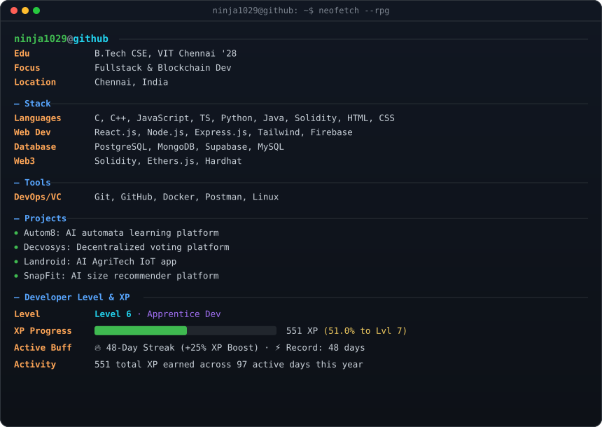
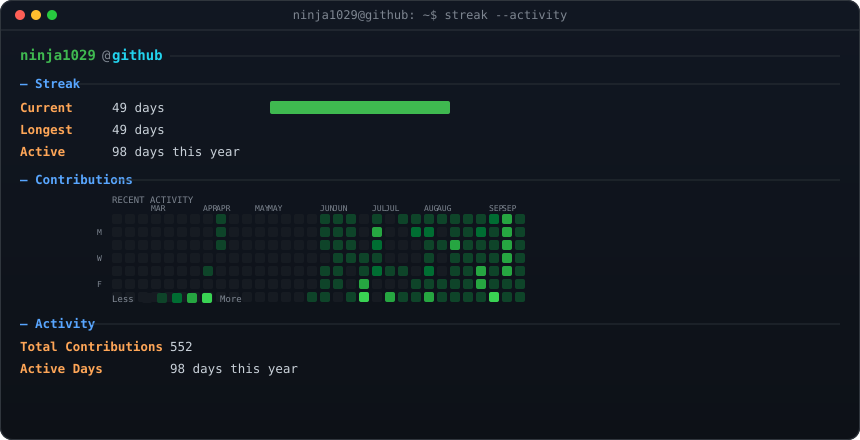

<!-- hero: monochrome ASCII portrait (types in) beside a neofetch-style info
     panel. regenerate portrait: python scripts/prep_photo.py <photo> &&
     python scripts/make_ascii_svg.py ; info panel: python scripts/make_info_card.py ; terminal streak card: python scripts/make_terminal_card.py -->

  

## Sudharsan M

**Fullstack & Blockchain Developer · CS Undergrad @ VIT**

 

